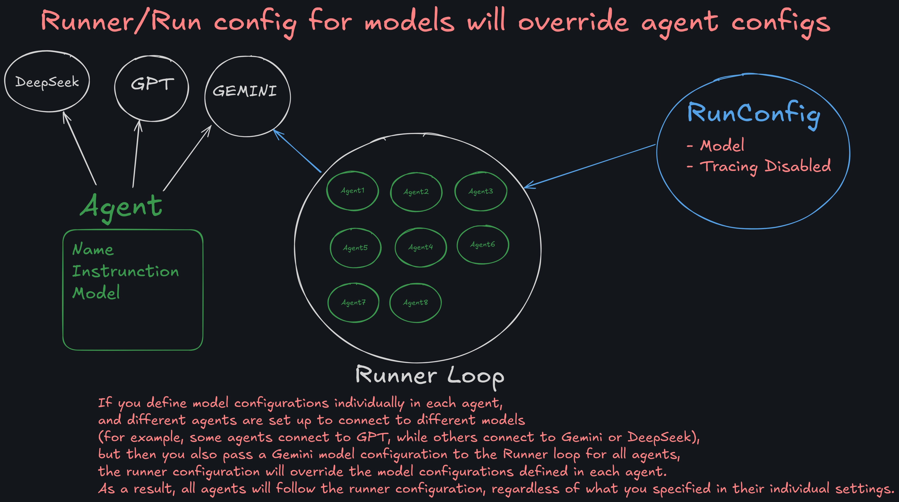

# 📘 Assignment Detail

### **Assignment 1: Basic FAQ Agent**

**Objective:**
Create a simple chatbot agent that answers a set of predefined questions (like “What is your name?”, “What can you do?”).

**Tasks:**

* Use the OpenAI Agent SDK to create an agent.
* Add a simple prompt or context about the agent (e.g., “You are a helpful FAQ bot.”).
* Run the agent and test it with at least five different questions and document the answers.

**Deliverable:**
Python file with agent code, screenshots of interactions.

---

### **Assignment 2: Math Function Tool Agent**

**Objective:**
Build an agent that can use a math function as a tool (for example, addition or multiplication).

**Tasks:**

* Define a Python function, e.g., `def add(a, b): return a + b`
* Register this function as a tool with your agent.
* Make the agent able to decide when to use the tool (e.g., “What is 5 + 7?” triggers the function).
* Test the agent with at least three math questions.

---

### **Assignment 3: Weather Info Agent (Tool Calling)**

**Objective:**
Make an agent that can fetch (mocked) weather info using a tool.

**Tasks:**

* Write a function `get_weather(city)` that returns a temperature for any city.
* you can use API (<https://www.weatherapi.com/>) to fetch the weather data of city
* Register this as a tool.
* Instruct the agent to use the tool if a user asks about weather.
* Test with different cities, e.g., “What’s the weather in Karachi?”

---

### **Assignment 4: Agent with Multiple Tools**

**Objective:**
Create an agent that can call more than one function/tool (e.g., math and weather).

**Tasks:**

* Add both an `add(a, b)` and `get_weather(city)` function as tools.
* Have the agent choose the correct tool based on user input.
* Test with both types of questions.

---

### **Assignment 5: Read the following links**
 - Agents [https://openai.github.io/openai-agents-python/agents/](https://openai.github.io/openai-agents-python/agents/)
 - Tools [https://openai.github.io/openai-agents-python/tools/](https://openai.github.io/openai-agents-python/tools/)
 - Agents Module [https://openai.github.io/openai-agents-python/ref/](https://openai.github.io/openai-agents-python/ref/)
 - Agents Reference [https://openai.github.io/openai-agents-python/ref/agent/](https://openai.github.io/openai-agents-python/ref/agent/)
 - Model Settings [https://openai.github.io/openai-agents-python/ref/model_settings/#agents.model_settings.ModelSettings](https://openai.github.io/openai-agents-python/ref/model_settings/#agents.model_settings.ModelSettings)

---

# 📘 Steps to Execute the Code 
## 🔐 1. Configure Environment Variables
- Rename the `.env.example` file to `.env`.
- Add your **Gemini API Key** in the `.env` file.

## 🧪 2. Generate API Key Using Google AI Studio
- Go to [Google AI Studio](https://makersuite.google.com/app).
- Sign in and **generate your Gemini API Key**.

## 📄 3. Read Gemini API Documentation
- Refer to the official **Gemini API documentation**.
- Ensure you understand its **OpenAI-compatible endpoints and usage patterns**.

## 4. Learn how to use UV
- Refer to the Github repository [UV](https://github.com/panaversity/learn-agentic-ai/tree/main/01_ai_agents_first/01_uv)

## 5. Learn Chainlit
- Refer to the Github repository [Chainlit](https://github.com/panaversity/learn-agentic-ai/tree/main/01_ai_agents_first/05_chainlit)
- Refer to the official documentation [Chainlit Documentation](https://docs.chainlit.io/get-started/overview)

## 6. How to build basic agents
- Refer to the Github repository [Basic Agents](https://github.com/panaversity/learn-agentic-ai/tree/main/01_ai_agents_first/04_hello_agent)

## 7. How to build tools
- Refer to the Github Repository [Tools](https://github.com/panaversity/learn-agentic-ai/tree/main/01_ai_agents_first/08_tools)

# Agent LLM tool calling

---

# Agent client model Flow

---

# Agent level configuration

---

# Run level configuration

---

# Global level configuration

---

# Config model override

