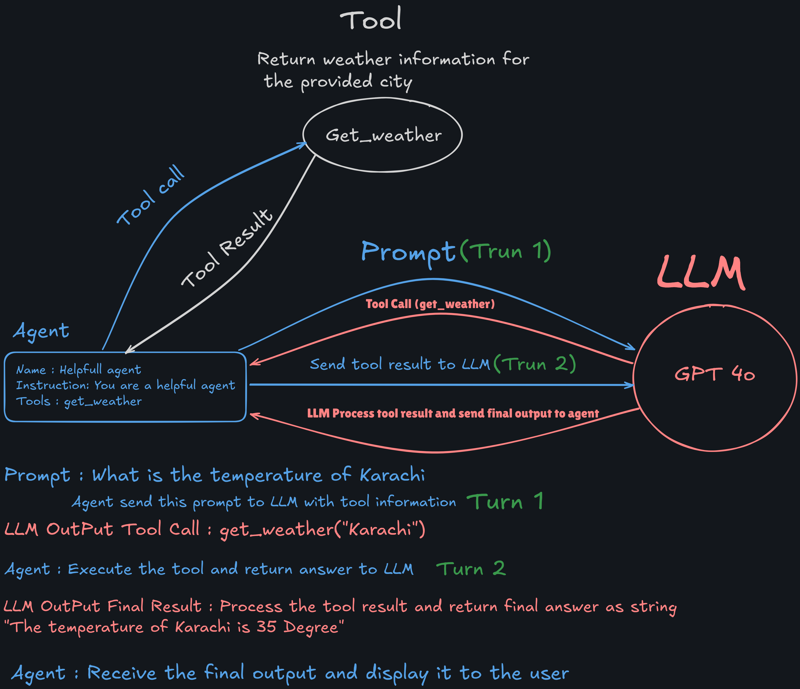
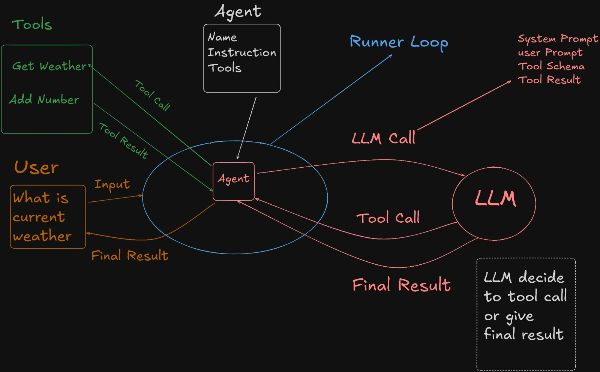

### **Read the following links**
 - Agents [https://openai.github.io/openai-agents-python/agents/](https://openai.github.io/openai-agents-python/agents/)
 - Tools [https://openai.github.io/openai-agents-python/tools/](https://openai.github.io/openai-agents-python/tools/)
 - Agents Module [https://openai.github.io/openai-agents-python/ref/](https://openai.github.io/openai-agents-python/ref/)
 - Agents Reference [https://openai.github.io/openai-agents-python/ref/agent/](https://openai.github.io/openai-agents-python/ref/agent/)
 - Model Settings [https://openai.github.io/openai-agents-python/ref/model_settings/#agents.model_settings.ModelSettings](https://openai.github.io/openai-agents-python/ref/model_settings/#agents.model_settings.ModelSettings)

---

# 📘 Steps to Execute the Code 
## 🔐 1. Configure Environment Variables.
- Add your **Gemini API Key** in the `.env` file.

## 🧪 2. Generate API Key Using Google AI Studio
- Go to [Google AI Studio](https://makersuite.google.com/app).
- Sign in and **generate your Gemini API Key**.

## 📄 3. Read Gemini API Documentation
- Refer to the official **Gemini API documentation**.
- Ensure you understand its **OpenAI-compatible endpoints and usage patterns**.

## 4. Learn how to use UV
- Refer to the Github repository [UV](https://github.com/panaversity/learn-agentic-ai/tree/main/01_ai_agents_first/01_uv)

## 5. Learn Chainlit
- Refer to the Github repository [Chainlit](https://github.com/panaversity/learn-agentic-ai/tree/main/01_ai_agents_first/05_chainlit)
- Refer to the official documentation [Chainlit Documentation](https://docs.chainlit.io/get-started/overview)

## 6. How to build basic agents
- Refer to the Github repository [Basic Agents](https://github.com/panaversity/learn-agentic-ai/tree/main/01_ai_agents_first/04_hello_agent)

## 7. How to build tools
- Refer to the Github Repository [Tools](https://github.com/panaversity/learn-agentic-ai/tree/main/01_ai_agents_first/08_tools)

# Agent LLM tool calling

---

# Agent Runner Loop

---

